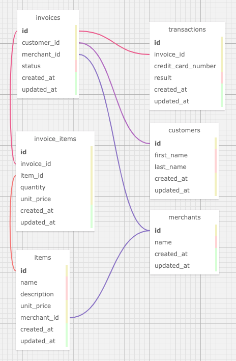

# Rails Engine Project

_Uses Rails and ActiveRecord to build a JSON api which exposes the SalesEngine data schema._

## Versions
- Ruby: 2.5.3
- Rails: 5.2.4.1

## Database
### Creation
_rake db:{create, migrate, seed}_

### Initialization
_rake db:import_csv_
delete data: _rake db:clear_data
### Schema

## How to run the test suite
_rails_engine_api/ rspec_
_rales_engine_spec_harness/ rspec_

## Evaluation
### Feature Delivery
Feature completeness will be determined using the spec harness

#### 1. Completion

4: Project completes all base requirements according to the spec harness plus one or more extensions.
3: Project completes all base requirements according to the spec harness.
2: Project completes most requirements but fails 4 or fewer spec harness tests.
1: Project fails more than 5-8 spec harness tests.
### Technical Quality
#### 1. Test-Driven Development

4: Project demonstrates high test coverage (>90%) and tests at the controller and unit levels.
3: Project demonstrates high test coverage (>80%) and tests at the controller and unit levels.
2: Project demonstrates high test coverage (>70%) but does not adequately balance controller and unit tests.
1: Project does not have 70% test coverage.
#### 2. Code Quality

4: Project demonstrates exceptionally well factored code.
3: Project demonstrates solid code quality and MVC principles.
2: Project demonstrates some gaps in code quality and/or application of MVC principles.
1: Project demonstrates poor factoring and/or understanding of MVC.
#### 3. API Design

4: Project exemplifies API design idioms, with consistent and coherent response structures, serializers to format JSON data, and effective request format handling.
3: Project uses strong and consistent data formats throughout, while relying mostly on standard Rails JSON features.
2: Project has inconsistencies or gaps in how its JSON data is organized or formatted.
1: Project’s API is not fully functional or has significant confusion around request formats.
#### 4. Queries

4: Project makes great use of ActiveRecord relationships and queries, including some advanced query functionality such as joins and select to create virtual attributes.
3: Project makes good use of ActiveRecord, but drops to ruby enumerables for some query methods.
2: Project has some gaps in ActiveRecord usage, including numerous business methods that rely on ruby enumerables to find the appropriate data.
1: Project struggles to establish a coherent ActiveRecords schema, including missing relationships or dysfunctional queries.
